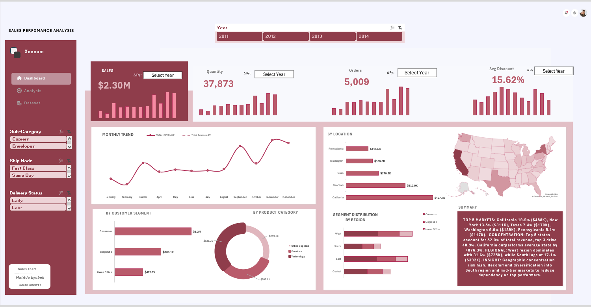

# Sales-Performance-Dashboard-Microsoft-Excel

**Project Summary**

This project is an interactive Sales Performance Dashboard developed in Microsoft Excel to analyze sales data and provide actionable business insights.

The dashboard was designed to support data-driven decision-making by presenting key performance indicators (KPIs), trend analysis, and performance breakdowns in a clear and structured format.

**Objectives**

- Transform raw transactional sales data into meaningful insights

- Track revenue performance and growth trends

- Identify top-performing products, regions, and customer segments

- Design an executive-ready dashboard for stakeholder reporting 

🛠 **Tools & Technical Skills**

- Microsoft Excel

- Pivot Tables & Pivot Charts

- Calculated Fields / Measures

- KPI Development

- Data Cleaning & Structuring

- Dashboard Design & Layout Optimization

- Analytical Thinking & Business Interpretation

**Key Features**

- Dynamic KPI Cards for revenue and performance tracking

- Growth & Trend Analysis over time

- Interactive Filters and Slicers for drill-down analysis

- Regional and Product Performance Breakdown

- Structured and professional dashboard layout for reporting

**Business Impact**

This dashboard enables stakeholders to:

- Quickly assess overall sales performance

- Monitor trends and identify revenue growth or decline

- Compare performance across products and regions

- Make informed strategic decisions based on visual insights

**Contact Me**

Thanks for taking the time to explore my work!
I’m always open to opportunities, collaborations, and conversations around data, analytics, and impactful projects.

**Email:** matildaeyubeh@gmail.com

**LinkedIn:** https://linkedin.com/in/matildaeyubeh

**GitHub:** https://github.com/NeyeTheAnalyst

**Let’s Connect If You’re:**

- Hiring a junior data analyst

- Looking for someone passionate about analytics

- Interested in collaborating on data projects

- Open to mentoring or knowledge exchange
